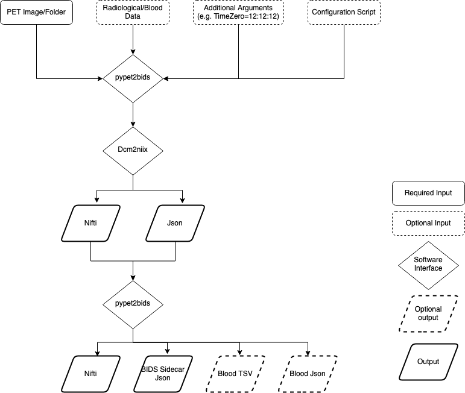

About
=====

**What does this tool do?**

PET2BIDS accepts PET imaging and blood data as inputs (e.g. dicom, ecat, spreadsheets)
and delivers BIDS formatted outputs (e.g. nifti, json, and tsv files). See the below diagram:

**It looks like you're just wrapping dcm2niix, why not just use it?**

That's a correct assessment, however:

1. dcm2niix only handles the conversion from dicom to nii and knows roughly what BIDS is,
   but the json file produced is not fully compliant with the standard
2. dicom data often doesn't have radioactivity information (e.g. injected dose)
   and that's why you need to provide it
3. conversion of blood data requires dedicated scripts and as dcm2niix has no idea what a spreadsheet is
   (which is implicit in the name dicom 2 niix)

**Where is the User Interface?**

The PET2BIDS library does not have an interface. We are however working with  `BIDSCoin <https://github.com/Donders-Institute/bidscoin>`_
and  `ezBIDS <https://brainlife.io/ezbids/>`_ to integrate our library into their GUI. You can however use the code as such.

**What is the command line for matlab?**

After setting up the library in your matlab path only 3 commands are needed: ``meta = get_pet_metadata(varargin)`` followed by either ``ecat2nii(file, meta)`` or ``dcm2niix4pet(dcmfolder,meta,'o','mynewfolder')``. For a comprehensive list of available commands/methods see :ref:`matlab`.

**What is the command line for Python or better, is there or command line interface?**

Yes there is a CLI and no you don't need to learn Python at all, but you're more than able to use this tool as a Python
library. For more information on usage individual methods or modules refer to :ref:`pypet2bids-package`.

**How do I use this tool?**

Please refer to the :ref:`usage` page for details on how to go about using this library or the :ref:`quickstart` page
for a small walk-through. Additionally, if you want to truly see how this software works on real data, take a look at
our CI on `Github <https://github.com/openneuropet/PET2BIDS/actions/workflows/setup_and_cli_test_posix.yaml>`_
as a further demonstration of running this software.

**This tool doesn't work/this is really hard....** 

Reshaping PET data into BIDS can often be difficult, but it's the goal of this library and it's developers to make the
process easier for you the user. If you are struggling with using the tools (or the tools are struggling to work
with your data) reach out us via our `Issues Page <https://github.com/openneuropet/PET2BIDS/issues>`_ or through our
`Website/Email <https://openneuropet.github.io/#[object%20Object]>`_.
