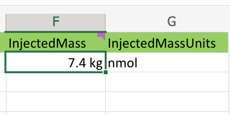
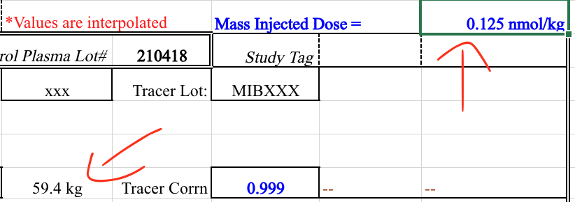
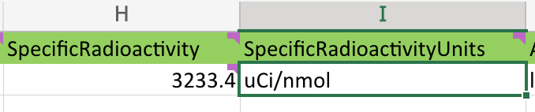
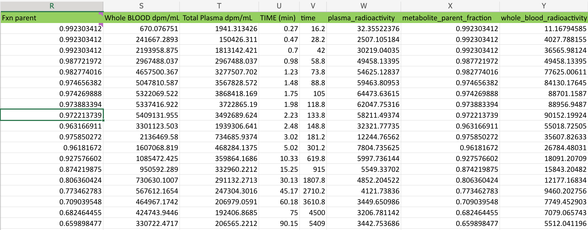

.. _spreadsheets:

============
Spreadsheets
============

Background and Motivation
-------------------------

PET data often comes in the form of a spreadsheet for example blood data can be attached to a subject or study via a
BIDS formatted `TSV`, a pmod `.bld` file, or a Microsoft Excel document. For that reason this entire section is
dedicated to the topic of spreadsheets and PET blood/radioligand/radioactivity data contained therein.

Handled Types of Spreadsheets (known)
-------------------------------------

`link to repository section <https://github.com/OpenNeuroPET/PET2BIDS/spreadsheet_conversion>`_

**Excel**

- `Ideal single subject example <https://github.com/OpenNeuroPET/PET2BIDS/spreadsheet_conversion/single_subject_sheet/subject_metadata_example.xlsx>`_
- Here is an example of a
  `Many Subject Spreadsheet <https://github.com/OpenNeuroPET/PET2BIDS/spreadsheet_conversion/many_subjects_sheet/subjects_metadata_example.xlsx>`_
  paired with a `single subject spreadsheet  <https://github.com/OpenNeuroPET/PET2BIDS/spreadsheet_conversion/many_subjects_sheet/subject_>`_
  these can be used when updating BIDS datasets w/ homogeneous scanner/experiment data along with heterogeneous (subject)
  data.

**Some more notes/quirks about Excel:**

Excel sometimes has a mind of it's own, see how this value for InjectedMass appears in the picture below:

As we can see there appear to be units contain in the source cells, and Excel helped us out by extracting them and also
failing to cancel them during the multiplication.

It appears Excel "inferred" the units from the source data, which is not what we want.

------------------------------------------------------------------------------------------------------------------------

In the previous example what we thought might have been user error, was not. However, where there are users, user error
will occur. This is one of the many reasons that BIDS relies on the `bids-validator`; automation doesn't get tired or
have Fridays.

See how in this example the user simply forgot to convert from microcuries to Becquerels:

------------------------------------------------------------------------------------------------------------------------

Occasionally, a user will chose to inject a BIDS friendly column next to a non-BIDS friendly column. This can be lead
to some confusion when browsing through a spreadsheet. However, PET2BIDS pays it no mind and neither should you. Best
practice would be to keep all BIDS friendly columns together in a single sheet, but this is not a requirement. This is
a *feature* and not a *bug*.

As we can see above a user pasted the original values into this sheet and then converted them into BIDS friendly columns
and units.
pypet2bids looks over every column in every sheet, it doesn't attach any meaning to where in a spreadsheet that a
column exists.

------------------------------------------------------------------------------------------------------------------------

**PMOD**

- `Example 1 from PMOD <https://github.com/OpenNeuroPET/PET2BIDS/spreadsheet_conversion/blood/pmod/Ex_frompmod>`_
- `Example 2 Manual and Autosampled Mixed data <https://github.com/OpenNeuroPET/PET2BIDS/spreadsheet_conversion/blood/pmod/Ex_manual_and_autosampled_mixed/>`_
- `Example 3 Whole Blood and Plasma Only <https://github.com/OpenNeuroPET/PET2BIDS/spreadsheet_conversion/blood/pmod/Ex_wholeblood_and_plasma_only/>`_

------------------------------------------------------------------------------------------------------------------------

**Auto Sampled Data**

In some scans an auto-sampler is used in conjunction with manual sampling. The data collected from these auto-samplers
is often provided in the form of a time column along with a whole blood count or calculated radioactivity column.

An example of a bids compliant auto-sampled tsv can be seen
`here <https://github.com/openneuropet/PET2BIDS/blob/653f0612da5a65c7dc6b8b112d17ae77d41af858/spreadsheet_conversion/blood/pmod/Ex_manual_and_autosampled_mixed/converted_recording-autosampler_blood.tsv>`_

These types of recordings are stored along side manually sampled blood data within the BIDS tree. In order to
differentiate between auto-sampled and manually sampled files the *recording* entity is used. e.g. this file would
be saved as:

.. code-block::

    sub-<label>_ses-<label>_recording-autosampler_blood.tsv
    sub-<label>_ses-<label>_recording-autosampler_blood.json
    sub-<label>_ses-<label>_recording-manual_blood.tsv
    sub-<label>_ses-<label>_recording-manual_blood.json

There is currently no language limiting the number of columns within an auto-sampled spreadsheet, however it is
required to contain the whole_blood data along with a corresponding time column. Interpolated data can be included as
well, such as plasma_radioactivity, but again this is considered by some to be calculated data since it is not collected
from the auto-sampler itself. Additional commentary and description over the merits and continually on going discussion
concerning raw vs. derived data are deliberately omitted at this time from this document; it could fill volumes the
writer is choosing to spare himself and the reader.

------------------------------------------------------------------------------------------------------------------------

PET2BIDS Methods and Tools
--------------------------

**Matlab**

------------------------------------------------------------------------------------------------------------------------

**Python**

------------------------------------------------------------------------------------------------------------------------

*Custom Spreadsheet Data Extractor*

Using the metadata translation script is not recommended, but remains as an option to the adventurous and not so easily
deterred users. This method requires very homogeneously formatted data (which is most likely
not the use case, hence the conversion to BIDS) and some programming knowledge. Further, there are a million and one
ways that it can go wrong. That said, one can create a custom extraction script to parse, convert, and update BIDS
fields at the time of conversion by including a spreadsheet file (tsv, xlsx, etc) and an extraction script to manipulate
the data contained within that spreadsheet.

Again for emphasis this method has the benefit of better preserving the original data, but the cost is that it requires
more fiddling directly in Python.

An example can be see below:

.. code-block::

    dcm2niix4pet /folder/with/PET/dicoms/ --destination /folder/with/PET/nifti_jsons
    --metadatapath /file/with/PET_metadata.xlsx --translation-script translate.py

It this point you may be asking self what is a metadata translation script? It's a python script designed to collect
relevant PET metadata from a spreadsheet. There are two approaches to extracting additional PET metadata from a
spreadsheet.

    - Format a spreadsheet to be more BIDS like and read use that data in the conversion:

      .. image:: media/image_example_bids_spreadsheet.png

      .. code-block::

            def translate_metadata(metadata_dataframe, image_path=NotImplemented):

            nifti_json = {
                'Manufacturer': '',
                'ManufacturersModelName': '',
                'Units': 'Bq/mL',
                'TracerName': '[11C]PS13',
                'TracerRadionuclide': '11C',
                'InjectedRadioactivity': metadata_dataframe['Analyzed:'][32]*(1/1000)*(37*10**9), # mCi convert to Bq -> (mCi /1000) *  37000000000
                'InjectedRadioactivityUnits': 'Bq',
                'InjectedMass': metadata_dataframe['Met365a.xls - 011104'][35] * metadata_dataframe['Analyzed:'][38] , #provided in nmol/kg for subject
                'InjectedMassUnits': 'nmol',
                'SpecificRadioactivity': 9218*37*10**9, # c11 is maximum 9218 Ci/umol,
                'SpecificRadioactivityUnits': 'Bq/mol',
                'ModeOfAdministration': 'bolus',
                'TimeZero': 0,
                'ScanStart': 0,
                'InjectionStart': 0,
                'FrameTimesStart': [],
                'FrameDuration': [],
                'AcquisitionMode': '',
                'ImageDecayCorrected': '',
                'ImageDecayCorrectionTime': 0,
                'ReconMethodName': '',
                'ReconMethodParameterLabels': [],
                'ReconMethodParameterUnits': [],
                'ReconMethodParameterValues': [],
                'ReconFilterType': '',
                'ReconFilterSize': 0,
                'AttenuationCorrection': '',
                'InstitutionName': '',
                'InstitutionalDepartmentName': ''
            }

If you're thinking it's to much to ask you to generate this script from scratch, you're absolutely right. You can
generate a template script by running the following command:

.. code-block::

    pet2bids-spreadsheet-template /path/to/save/template/script.py
    ls /path/to/save/template/script.py
    script.py

Now assuming you've located your dicom images, set up your template script/and or your metadata spreadsheet you should
be able produce the output resembling the following:

.. code-block::

    machine:folder user$ ls ~/Desktop/testdcm2niix4pet/
    PET_Brain_Dyn_TOF_7801580_20180322104003_5.json         PET_Brain_Dyn_TOF_7801580_20180322104003_5_blood.json
    PET_Brain_Dyn_TOF_7801580_20180322104003_5.nii.gz       PET_Brain_Dyn_TOF_7801580_20180322104003_5_blood.tsv
