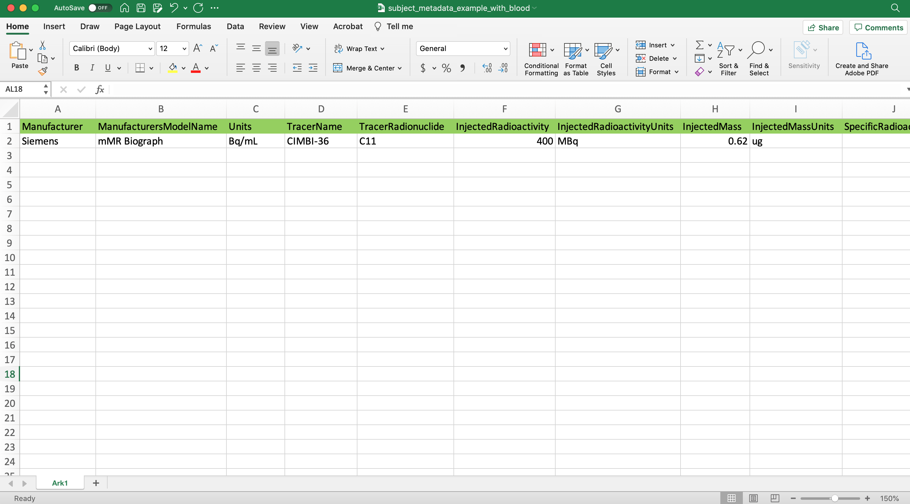

.. _usage:

Usage
=====

Matlab
------

**Read and write raw scanner files as nifti + json**

BIDS requires nifti files and json. While json can be written be hand, this is more convenient to populate them as one
reads data. One issue is that some information is not encoded in ecat/dicom headers and thus needs to be created
otherwise.

**Using matlab code**

To simplify the curation of json files, one uses the
`get_pet_metadata.m <https://github.com/openneuropet/PET2BIDS/blob/main/matlab/get_pet_metadata.m>`_ function. This
function takes as arguments the scanner info (thus loading the relevant *parameters.txt file) and also need some manual
input related to the injected tracer.
  
*Feel free to reach out if you have an issue with your scanner files, we can help*.

The simplest way to convert DICOM files is to call
`dcm2niix4pet.m <https://github.com/openneuropet/PET2BIDS/blob/main/matlab/dcm2niix4pet.m>`_ which wraps around
dcm2niix. Assuming dcm2niix is present in your environment, Matlab will call it to convert your data to nifti and json
- and the wrapper function will additionally edit the json file. Arguments in are the dcm folder(s) in, the metadata
as a structure (using the get_pet_metadata.m function for instance) and possibly options as per dcm2niix.

*Note for windows user*: edit the dcm2niix4pet.m line 51 to indicate where is the .exe function located

.. code-block::

    meta = get_pet_metadata('Scanner','SiemensBiograph','TimeZero','ScanStart',
    'TracerName','CB36','TracerRadionuclide','C11', 'ModeOfAdministration', 'infusion',
    'SpecificRadioactivity', 605.3220,'InjectedMass', 1.5934,
    'MolarActivity', 107.66, 'InstitutionName','Rigshospitalet, NRU, DK',
    'AcquisitionMode','list mode','ImageDecayCorrected','true',
    'ImageDecayCorrectionTime' ,0,'ReconMethodName','OP-OSEM',
    'ReconMethodParameterLabels',{'subsets','iterations'},
    'ReconMethodParameterUnits',{'none','none'}, 'ReconMethodParameterValues',[21 3],
    'ReconFilterType','XYZGAUSSIAN', 'ReconFilterSize',2,
    'AttenuationCorrection','CT-based attenuation correction');

    dcm2niix4pet(dcmfolder,meta,'o','mynewfolder');

The get_pet_metadata function can be called in a much simpler way if you have a `*parameters.txt` seating on disk next to this function. The call would then looks like:

.. code-block::

    meta = get_pet_metadata('Scanner','SiemensBiograph','TimeZero','ScanStart',
    'TracerName','CB36', 'TracerRadionuclide','C11', 'ModeOfAdministration',
    'infusion','SpecificRadioactivity', 605.3220, 'InjectedMass', 1.5934,
    'MolarActivity', 107.66);

    dcm2niix4pet(dcmfolder,meta,'o','mynewfolder');

*Alternatively*, you could have data already converted to nifti and json, and you need to update the json file. This can be done 2 ways:

1. Use the `updatejsonpetfile.m <https://github.com/openneuropet/PET2BIDS/blob/main/matlab/updatejsonpetfile.m>`_
function. Arguments in are the json file to update and metadata to add as a structure (using a get_metadata.m function
for instance) and possibly a dicom file to check additional fields. This is show below for data from the biograph.

.. code-block::

    jsonfilename = fullfile(pwd,'DBS_Gris_13_FullCT_DBS_Az_2mm_PRR_AC_Images_20151109090448_48.json')
    # your SiemensBiographparameters.txt file is stored next to get_pet_metadata.m

    metadata = get_pet_metadata('Scanner','SiemensBiograph','TimeZero','ScanStart',
    'TracerName','AZ10416936','TracerRadionuclide','C11',
    'ModeOfAdministration','bolus','InjectedRadioactivity', 605.3220,
    'InjectedMass', 1.5934,'MolarActivity', 107.66);

    dcminfo = dicominfo('DBSGRIS13.PT.PETMR_NRU.48.13.2015.11.11.14.03.16.226.61519201.dcm');
    status = updatejsonpetfile(jsonfilename,metadata,dcminfo)``

2. Add the metadata 'manually' to the json file, shown below for GE Advance data. 

.. code-block::

    metadata1 = jsondecode(textread(myjsonfile.json)); % or use jsonread from the matlab BIDS library

    %your GEAdvance.txt file is stored next to get_pet_metadata.m

    metadata2 = get_pet_metadata('Scanner', 'GEAdvance','TimeZero','XXX','TracerName','DASB','TracerRadionuclide','C11',
    'ModeOfAdministration','bolus', 'InjectedRadioactivity', 605.3220,'InjectedMass', 1.5934,'MolarActivity', 107.66);

    metadata  = [metadata2;metadata1];
    jsonwrite('mynewjsonfile.json'],metadata)

**Converting ecat files**

If you have ecat (.v) instead of dicom (.dcm), we have build a dedicated converter. Arguments in are the file to
convert and some metadata as a structure (using the get_pet_metadata.m function for instance). This is shown below
for HRRT data.

Your SiemensHRRT.txt file is stored next to get_pet_metadata.m

.. code-block::

    metadata = get_pet_metadata('Scanner','SiemensHRRT','TimeZero','XXX',
    'TracerName','DASB','TracerRadionuclide', 'C11',
    'ModeOfAdministration','bolus', 'InjectedRadioactivity',605.3220,
    'InjectedMass', 1.5934,'MolarActivity', 107.66);

    ecat2nii({full_file_name},{metadata})
 
See the `documentation <https://github.com/openneuropet/PET2BIDS/blob/main/matlab/unit_tests/Readme.md>`_ for further
details on ecat conversion

Python
------

The python library is available for use on Posix systems (OSX and Linux) and Windows. Posix installation
requires that dcm2niix be installed and findable on the system path. Windows requires the user to provide
the path to dcm2niix within an environment variable in a config file.

For more information on how to
install dcm2niix see `here <https://github.com/rordenlab/dcm2niix#install>`__.

.. raw:: html

    

If successfully installed you should have access to 2 command line tools, check to see if they are available via your
terminal/commandline by typing the following into your cmd window:

- dcm2niix4pet
- ecatpet2bids

You should see the following afterwards:

.. code-block::

    Microsoft Windows [Version 10.0.19042.2006]
    (c) Microsoft Corporation. All rights reserved.

    H:\>dcm2niix4pet
    usage: dcm2niix4pet [-h] [--metadata-path METADATA_PATH] [--translation-script-path TRANSLATION_SCRIPT_PATH]
                        [--destination-path DESTINATION_PATH] [--kwargs [KWARGS ...]] [--silent SILENT] [--show-examples]
                        [--set-dcm2niix-path SET_DCM2NIIX_PATH]
                        [folder]

    H:\>ecatpet2bids
    usage: ecat_cli.py [-h] [--affine] [--convert] [--dump] [--json] [--nifti file_name] [--subheader] [--sidecar]
                       [--kwargs [KWARGS ...]] [--scannerparams [SCANNERPARAMS ...]] [--directory_table]
                       [--show-examples]
                       [ecat_file]

ecatpet2bids for converting ecat data into nii & json

.. code-block::

    # our ecat conversion library should be available via the following
    ecatpet2bids -h
    usage: ecatpet2bids [-h] [--affine] [--convert] [--dump] [--json] [--nifti file_name] [--subheader] [--sidecar] [--kwargs [KWARGS ...]] [--scannerparams [SCANNERPARAMS ...]] [--directory_table]
                    ecat_file

    positional arguments:
      ecat_file             Ecat image to collect info from.

    optional arguments:
      -h, --help            show this help message and exit
      --affine, -a          Show affine matrix
      --convert, -c         If supplied will attempt conversion.
      --dump, -d            Dump information in Header
      --json, -j            Output header and subheader info as JSON to stdout, overrides all other options
      --nifti file_name, -n file_name
                            Name of nifti output file
      --subheader, -s       Display subheaders
      --sidecar             Output a bids formatted sidecar for pairing with a nifti.
      --kwargs [KWARGS ...], -k [KWARGS ...]
                            Include additional values int the nifti sidecar json or override values extracted from the supplied nifti. e.g. including `--kwargs TimeZero='12:12:12'` would override the
                            calculated TimeZero. Any number of additional arguments can be supplied after --kwargs e.g. `--kwargs BidsVariable1=1 BidsVariable2=2` etc etc.
      --scannerparams [SCANNERPARAMS ...]
                            Loads saved scanner params from a configuration file following --scanner-params/-s if this option is used without an argument this cli will look for any scanner parameters file
                            in the directory with the name *parameters.txt from which this cli is called.
      --directory_table, -t
                            Collect table/array of ECAT frame byte location map

For converting dicom to BIDS use dcm2niix4pet via:

.. code-block::

    dcm2niix4pet -h
    usage: dcm2niix4pet [-h] [--metadata-path METADATA_PATH] [--translation-script-path TRANSLATION_SCRIPT_PATH] [--destination-path DESTINATION_PATH] [--kwargs [KWARGS ...]] [--silent SILENT]
                    [--write-template-script]
                    folder

    positional arguments:
      folder                Folder path containing imaging data

    optional arguments:
      -h, --help            show this help message and exit
      --metadata-path METADATA_PATH, -m METADATA_PATH
                            Path to metadata file for scan
      --translation-script-path TRANSLATION_SCRIPT_PATH, -t TRANSLATION_SCRIPT_PATH
                            Path to a script written to extract and transform metadata from a spreadsheet to BIDS compliant text files (tsv and json)
      --destination-path DESTINATION_PATH, -d DESTINATION_PATH
                            Destination path to send converted imaging and metadata files to. If omitted defaults to using the path supplied to folder path. If destination path doesn't exist an attempt to
                            create it will be made.
      --kwargs [KWARGS ...], -k [KWARGS ...]
                            Include additional values int the nifti sidecar json or override values extracted from the supplied nifti. e.g. including `--kwargs TimeZero='12:12:12'` would override the
                            calculated TimeZero. Any number of additional arguments can be supplied after --kwargs e.g. `--kwargs BidsVariable1=1 BidsVariable2=2` etc etc.
      --silent SILENT, -s SILENT
                            Display missing metadata warnings and errorsto stdout/stderr

**Using pypet2bids**

Pypet2bids is primarily designed to run as a command line utility, design choice was made for 2 purposes:

1) to provide a universal interface (API) so the library is operable with any scripting or programming language
2) keeping the usage as simple as possible, use of this library is as simple as install -> run command

Additionally, one has access to the underlying python methods and classes if one wishes to use this library from within
a Python environment.

------------------------------------------------------------------------------------------------------------------------

Command line usage:

In the most simple use case one can convert a folder full of dicoms into a NIFTI

.. code-block::

    dcm2niix4pet /folder/with/PET/dicoms/ -d /folder/with/PET/nifti_jsons

However, more often than not the information required to create a valid PET BIDS nifti and json isn't present
w/ in the dicom headers of the PET Image files.

Often additional radiological information will need to
be passed to pypet2bids in addition to PET imaging data. Passing this data can be done in a number of increasingly
complex ways. The simplest method to pass on information is directly at the command line when calling either
**dcm2niix4pet** or **ecatpet2bids**. Both of these tools accept additional arguments via key pair's separated by the
equals sign `=`. This functionality is designed to mirror that of the Matlab code.

Some extra values in the case of this Siemens Biograph would look like the following:

.. code-block::

    dcm2niix4pet OpenNeuroPET-Phantoms/source/SiemensBiographPETMR-NRU --kwargs
    TimeZero=ScanStart
    Manufacturer=Siemens
    ManufacturersModelName=Biograph InstitutionName="Rigshospitalet, NRU, DK"
    BodyPart=Phantom
    Units=Bq/mL
    TracerName=none
    TracerRadionuclide=F18
    InjectedRadioactivity=81.24
    SpecificRadioactivity=13019.23
    ModeOfAdministration=infusion
    FrameTimesStart=0
    AcquisitionMode="list mode"
    ImageDecayCorrected=true
    ImageDecayCorrectionTime=0
    AttenuationCorrection=MR-corrected
    FrameDuration=300
    FrameTimesStart=0

And similarly, extra key pair values can be passed to ecatpet2bids:

.. code-block::

    ecatpet2bids OpenNeuroPET-Phantoms/source/SiemensHRRT-NRU/XCal-Hrrt-2022.04.21.15.43.05_EM_3D.v
    --convert
    --kwargs
    TimeZero=ScanStart
    Manufacturer=Siemens
    ManufacturersModelName=HRRT
    InstitutionName="Rigshospitalet, NRU, DK"
    BodyPart=Phantom
    Units=Bq/mL
    TracerName=none
    TracerRadionuclide=F18
    InjectedRadioactivity=81.24
    SpecificRadioactivity=13019.23
    ModeOfAdministration=infusion
    AcquisitionMode="list mode"
    ImageDecayCorrected=true
    ImageDecayCorrectionTime=0
    AttenuationCorrection="10-min transmission scan"

------------------------------------------------------------------------------------------------------------------------

An additional method to Extract/inject information at the time of conversion involves the use of a spreadsheet. By
including a spreadsheet file (tsv, xlsx, etc) that has been formatted like the following:

Then point the optional `metadatapath` flag at the spreadsheet location:

.. code-block::

    dcm2niix4pet /folder/containing/PET/dicoms/
    --destination /folder/containing/PET/nifti_jsons
    --metadatapath /file/PET_metadata.xlsx

Development and Testing
-----------------------

PET2BIDS makes use of both unit and integration tests to ensure that the code is working as expected. Phantom,
synthetic imaging, and blood test data can be retrieved directly from either this repository or via the url contained
within the **collectphantoms** make command in the top level Makefile. Tests are written with relative paths to the test
data contained in several directories within this repository:

1) metadata/
2) ecat_validation/
3) tests/
4) OpenNeuroPET-Phantoms/ (this last directory needs be downloaded separately with the make commands `collectphantoms` and `unzipphantoms`)

The unit tests for Python can be found in the `tests` folder and are run using the `pytest` library. Python tests are
best run with `poetry run`:

.. code-block::

    poetry run pytest test/<test_file_name>.py

The matlab unit tests can be found in the `matlab/unit_tests` folder and are run in Matlab after adding this repository
and its contents to you Matlab path.

.. code-block::

    addpath('path/to/PET2BIDS/matlab')
    addpath('path/to/PET2BIDS/matlab/unit_tests')

Integration tests are run using the `make testphantoms` command. However, running the Matlab integration tests requires
the user add the script located in `OpenNeuroPET-Phantoms/code/matlab_conversions.m` to their Matlab path.

To emulate the CI/CD pipeline, the following commands can be run locally in the following order:

.. code-block::

    make testphantoms
    make testpython

Documentation for Read the Docs can be built and previewed locally using the following command:

.. code-block::

    make html

The output of the build can be found at docs/_build/html/ and previewed by opening any of the html files contained
therein with a web browser. Chances are good if you're able to build with no errors locally than any changes you make
to the documentation rst files will be built successfully on Read the Docs, but not guaranteed.

Working with existing NiFTi and JSON files
------------------------------------------

PET2BIDS is primarily designed to work with DICOM and ECAT files, but it can also be used to add or update sidecar json
metadata after conversion to NiFTi (whether by PET2BIDS or some other tool). This can be done using the
`updatejsonpetfile.m` function in Matlab or the `updatepetjson` command line tool in Python. Additionally, if one has
dicom or ecat files available to them they can use `updatepetjsonfromdicom` or `updatepetjsonfromecat` respectively
instead of `updatepetjson` or `updatejsonpetfile.m`.

*Disclaimer:
Again, we strongly encourage users to use PET2BIDS or dcm2niix to convert their data from dicom or ecat into nifti.
We have observed that nifti's not produced by dcm2niix are often missing dicom metadata such as frame timing or image
orientation. Additionally some non-dcm2niix nifti's contain extra singleton dimensions or extended but undefined main
image headers.*

Examples of using the command line tools can be seen below:

.. code-block::

    updatepetjson /path/to/nifti.nii /path/to/json.json --kwargs TimeZero=12:12:12
    updatepetjsonfromdicom /path/to/dicom.dcm /path/to/json.json --kwargs TimeZero=12:12:12
    updatepetjsonfromecat /path/to/ecat.v /path/to/json.json --kwargs TimeZero=12:12:12

.. code-block::

    # run matlab to get this output
    >> jsonfilename = fullfile(pwd,'DBS_Gris_13_FullCT_DBS_Az_2mm_PRR_AC_Images_20151109090448_48.json');
    >> metadata = get_SiemensBiograph_metadata('TimeZero','ScanStart','tracer','AZ10416936','Radionuclide','C11',
       ... 'ModeOfAdministration','bolus','Radioactivity', 605.3220,'InjectedMass', 1.5934,'MolarActivity', 107.66);
    >> dcminfo = dicominfo('DBSGRIS13.PT.PETMR_NRU.48.13.2015.11.11.14.03.16.226.61519201.dcm');
    >> status = updatejsonpetfile(jsonfilename,metadata,dcminfo);