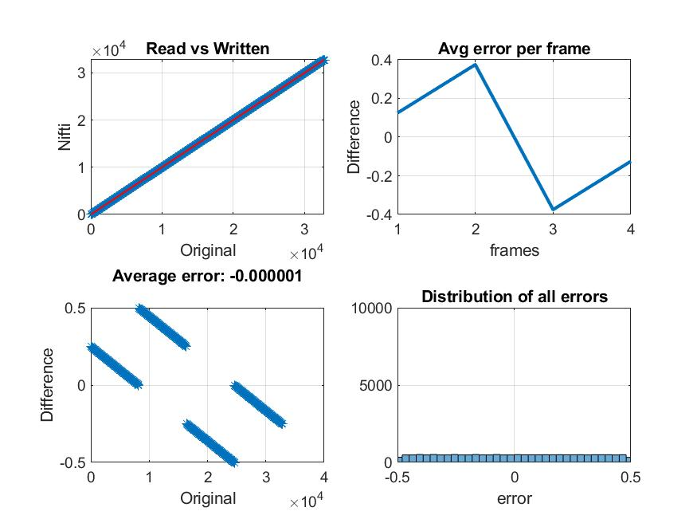

## Siemens - ECAT7

## ecat_info

During our effort to create a converter to BIDS, we came across some documentation that might be useful to others - so 
we stored it here. Please feel free to create a pull request or reach out to us if you have any additional information
to contribute concerning the ECAT filetype/specification. Our knowledge only extends to ECAT versions 6.3, 7.2, and 7.3,
and may always be improved.

## Validation

### Motivation
We wished to quantify how reliably our ECAT to nifti tools translated ecat pixel arrays. After observing some major 
differences between our own tools as well as other existing ecat2nii/neuroimaging libraries we decided that we should 
first create an extremely standard and well behaved sythentic ecat file populated with known values. The image is simply
a 4d array of pixel values increasing from 0 to 32766, the dimensions were picked because they cover (most of) the range
of unsigned int16 which is the most common type of pixel data element seen in the ECAT file format. 

**Note:** ECAT supports pixel arrays of float and integer data types, but we've only ever seen pixel data as uint16. Hence, 
the strange naming convention of our golden ecat files. Maybe we will test floats, most likely not.

The synthetic ecat data of size 16 * 16 * 16 * 4 were created using golden_ecat.py 
the gzipped output can be found [here](synthetic_ecat_integer_16x16x16x4.v.gz), additionally the values of each voxel
are saved directly as .mat for later comparison and analysis [here](synthetic_ecat_integer_16x16x16x4.mat). 
The script used to create this synthetic "golden" ecat file [golden_ecat.py](..pypet2bids/pypet2bids/golden_ecat.py) 
makes use of functions in [pypet2bids/write_ecat.py](../pypet2bids/pypet2bids/write_ecat.py) which allow us to modify 
and write the main header, directory table, sub headers, and pixel data of an ECAT file.

### Image Creation

In short the pixel values were created:

```python
number_of_frames = 4
one_dimension = 16
# generate known 'pixel' data e.g. 4 frames with volume = 4x4x4
number_of_array_elements = (one_dimension**3) * number_of_frames

# first generate integer pixel data
# 0 to 32767
image_min = 0
image_max = 32767
spacing = round((image_max - image_min) / number_of_array_elements)

#integer_pixel_data = numpy.arange(image_min, image_max, dtype=numpy.ushort, step=spacing)
integer_pixel_data = numpy.arange(image_min, image_max, dtype=">H", step=spacing)
```

An existing ECAT image's header was used as a basis for the synthetic ECAT's header and subheaders:

```python
# edit the header to suit the new file
header_to_write = skeleton_main_header
header_to_write['NUM_FRAMES'] = 4
header_to_write['ORIGINAL_FILE_NAME'] = 'GoldenECATInteger'
header_to_write['STUDY_TYPE'] = 'Golden'
header_to_write['PATIENT_ID'] = 'PerfectPatient'
header_to_write['PATIENT_NAME'] = 'Majesty'
header_to_write['FACILITY_NAME'] = 'Virtual'
header_to_write['NUM_PLANES'] = one_dimension
header_to_write['ECAT_CALIBRATION_FACTOR'] = 1.0 # keeping things simple so that our multiplication doesn't confuse us
```

And lastly the main header, sub headers (modification not shown), and pixel data are fed to a `write_ecat` method and the
ecat file is generated:

```python
write_ecat(ecat_file=int_golden_ecat_path,
               mainheader_schema=ecat_header_maps['ecat_headers']['73']['mainheader'],
               mainheader_values=header_to_write,
               subheaders_values=subheaders_to_write,
               subheader_schema=ecat_header_maps['ecat_headers']['73']['7'],
               number_of_frames=number_of_frames,
               pixel_x_dimension=one_dimension,
               pixel_y_dimension=one_dimension,
               pixel_z_dimension=one_dimension,
               pixel_byte_size=2,
               pixel_data=frames
               )
```

### Results

The  validation ecat2nii_test.m then read the .v, convert to .nii, and reread the .nii. It then compares the reread values to
expected ones (from the .mat). Ideally we would have the same values but (1) we have different dynamic range 
(here only 1 out of 16bits ~0.0003) because ecat2nii rescale your data to 16bits and (2) precisions around 0 differs as 
well, some small changes are expected. This can be seen in the figure below. Reread vs Original show a 
perfect correlation, but with an average difference of -0.000001 with min -05 and max 0.5 
(to put this in perspective, it means for PET images, differences are equivalent of 1 photon detection - we can live 
with that).



## Conversion

The ecat file ECAT7_multiframe.v was converted here as a test, with ecat2nii.m as follows

```matlab
file          = fullfile(pwd,'ECAT7_multiframe.v.gz'); % edit with the right path
meta.TimeZero = datestr(now,'hh:mm:ss'); % that metadata cannot be skipped
ecat2nii(file,meta)
```

Similarly, in Python

```python
from pypet2bids.ecat import Ecat
ecat = Ecat(ecat_file='ECAT7_multiframe.v.gz')
ecat.make_nifti()
```

Or more commonly the ECAT is converted using the CLI:

```bash
pip install pypet2bids
ecatpet2bids ECAT7_multiframe.v.gz --convert
```

This illustrates [what metadata are extracted from the ecat file](https://github.com/openneuropet/PET2BIDS/blob/main/ecat_validation/ECAT7_multiframe.json) - which does not comform with BIDS because radiochemistry and pharmaceutical metadata are missing.
